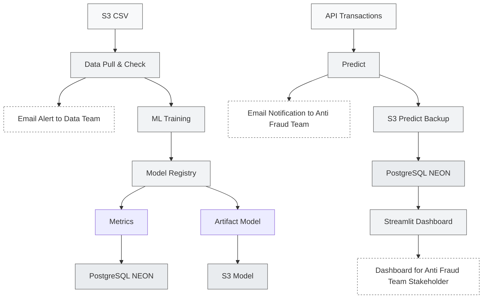

# AIA - BLOC_03 : FRAUD DETECTION 🕵 

## Présentation en ligne de l'intégralité du projet

🚀 [Bloc_03 | FRAUD DETECTION | Présentation PPT](https://docs.google.com/presentation/d/1EUjt6ZuZBRxjuxuWD4OKV9wgqbWGHm1zGtCbE3KnmMc/edit?usp=sharing) \
📁 [Bloc_03 | FRAUD DETECTION | Backup sur GitHub](https://github.com/eric-nguyen-jedha/AIA-CERTIF/tree/main/BLOC_03)


# Pipeline de Détection de Fraude avec Airflow, XGBoost et MLflow

Ce projet implémente un **pipeline automatisé de détection de fraude** en deux étapes :
1. **Vérification de la qualité des données** (Drift, tests statistiques) avec Evidently.
2. **Entraînement d'un modèle XGBoost** et suivi des expériences avec MLflow.

Le pipeline est orchestré avec **Apache Airflow**, et les artefacts sont stockés sur S3.

---

## 📌 Architecture Globale




## 📂 Structure du Projet

```
BLOC_03/
├── AIRFLOW/
│ ├── config/
│ │ └── airflow.cfg # Configuration principale d’Airflow
│ ├── dags/
│ │ ├── fraud_detection_datacheck.py # DAG de validation des données (pré-processing)
│ │ ├── fraud_detection_ml.py # DAG d’entraînement du modèle de détection de fraude
│ │ ├── fraud_detection_predict.py # DAG de prédiction en production
│ │ └── fraud_detection_recap24h.py # DAG de résumé journalier (rapport, monitoring)
│ ├── data/
│ │ ├── current_transactions_raw.csv # Données brutes des transactions
│ │ ├── current_transactions_clean.csv # Données nettoyées après preprocessing
│ │ ├── fraud_detection_on_going.csv # Données en cours de traitement / surveillance
│ │ └── predictions.csv # Résultats des prédictions générées
│ ├── docker-compose.yaml # Orchestration Docker pour Airflow
│ └── Dockerfile # Image Docker pour l’environnement Airflow
├── plugins/
│ └── s3_to_postgres.py # Plugin Airflow personnalisé (transfert S3 → PostgreSQL)
├── requirements.txt # Dépendances Python globales du projet
├── eda_fraud.ipynb # Notebook d’analyse exploratoire des données (EDA) : FraudTest.csv
├── MLFLOW/
│ ├── Dockerfile # Image Docker pour l’environnement MLflow
│ ├── README.md # Documentation du module MLflow
│ ├── requirements.txt # Dépendances spécifiques à MLflow
│ └── pairplot.png # Visualisation graphique (ex: scatter plot ou heatmap)
├── README.md # Documentation générale du projet BLOC_03
├── STREAMLIT/
│ ├── app.py # app_streamlit.py # Application Streamlit pour visualisation des résultats
│ ├── Dockerfile # Image Docker pour le déploiement de l’app Streamlit
│ ├── README.md # Documentation du module Streamlit
│ └── requirements.txt # Dépendances spécifiques à l’app Streamlit

```

Accédez à `http://localhost:8080` pour se connecter à Airflow 𖣘 :

## 1️⃣ DAG fraud_detection_01_evidently_data_quality

Objectif : Vérifier la qualité des données avant l'entraînement.
Fonctionnalités :

- download_fraud_csv : Télécharge le dataset fraudTest.csv depuis une URL.
- evidently_check : Génère un rapport de drift (visuel) et une test suite (textuelle) avec Evidently.
- upload_reports_to_s3 : Sauvegarde les rapports en local et sur S3.
- send_evidently_report_email : Envoie un email de résumé avec les liens vers les rapports.
- trigger_xgboost_dag : Déclenche le DAG suivant (fraud_detection_xgboost_dag) en passant le chemin du fichier CSV.

## 2️⃣ DAG fraud_detection_02_xgboost_dag
Objectif : Entraîner un modèle XGBoost pour détecter les fraudes.
Fonctionnalités :

- load_csv : Récupère le chemin du fichier CSV passé par le DAG précédent (dag_run.conf).
- clean_data : Nettoie les données (feature engineering, encodage, etc.).
- train_mlflow : Entraîne un modèle XGBoost avec suivi des métriques via MLflow. Sauvegarde la matrice de confusion et log le modèle.

## 3️⃣ DAG fraud_detection_03_prediction_api
Objectif : Faire une prédiction en temps réel d'une Fraude .
Fonctionnalités :

- fetch_transactions : Récupère la transaction qui vient de l'API.
- preprocess_data : Nettoie les données et les rend conforme au modèle d'entrainement
- predict_and_save : Faire une prédiction avec le code Predict de MLFLOW et sauvegarder le résultat dans un CSV mais aussi dans la Base Neon BD (PostgreSQL)
- upload_and_alert : Upload les résultats dans un fichier CSV et envoie une notification à l'équipe DATA

## 4️⃣ DAG fraud_detection_04_recap_email

- send_fraud_recap_email : Se connecte à la base de donnée PosteGreSQL, calcule les stats des dernières 24H et envoie un résumé ainsi que le lien pour se connecter au Dashboard


## Variable #Airflow

Variable,Description
- AWS_ACCESS_KEY_ID,Clé AWS pour accéder à S3.
- AWS_SECRET_ACCESS_KEY,Secret AWS.
- BUCKET,Nom du bucket S3 pour les rapports.
- ARTIFACT_STORE_URI,URI du stockage MLflow.
- BACKEND_STORE_URI_FP,URI du backend MLflow.

## 📩 SMPT de Airflow est configuré avec GMAIL
- dans l'Admin/Connection : configurer le SMTP avec le port : 587

```
# Utilisation du smtplib.SMTP
with smtplib.SMTP(smtp_host, smtp_port) as server:
            if use_tls:
                server.starttls()
            server.login(conn.login, conn.password)
            server.send_message(msg)
```            

## 🔧 Comment Lancer le Pipeline ?
1. Déployer les DAGs

Copier les fichiers .py dans le dossier dags/ d'Airflow.
Activer les DAGs dans l'UI Airflow.

2. Exécuter manuellement (optionnel)

Dans l'UI Airflow, cliquer sur Trigger DAG pour evidently_data_quality_fraud.
Le DAG XGBoost sera déclenché automatiquement.

3. Vérifier les résultats

Rapports : Voir les emails envoyés ou les fichiers dans le bucket S3.
Modèle : Consulter l'expérience MLflow à l'URL configurée.


⚠️ Points d'Attention

- Dépendances : Vérifier que toutes les librairies sont installées dans l'environnement Airflow.
- Permissions S3 : Le rôle IAM doit avoir les droits s3:PutObject et s3:GetObject.
- MLflow : L'URI du tracking doit être accessible depuis Airflow. MLFLOW est installé sur Hugging Face dans un Docker 
- Chemin des fichiers : Le dossier /opt/airflow/data doit être monté et accessible en écriture.